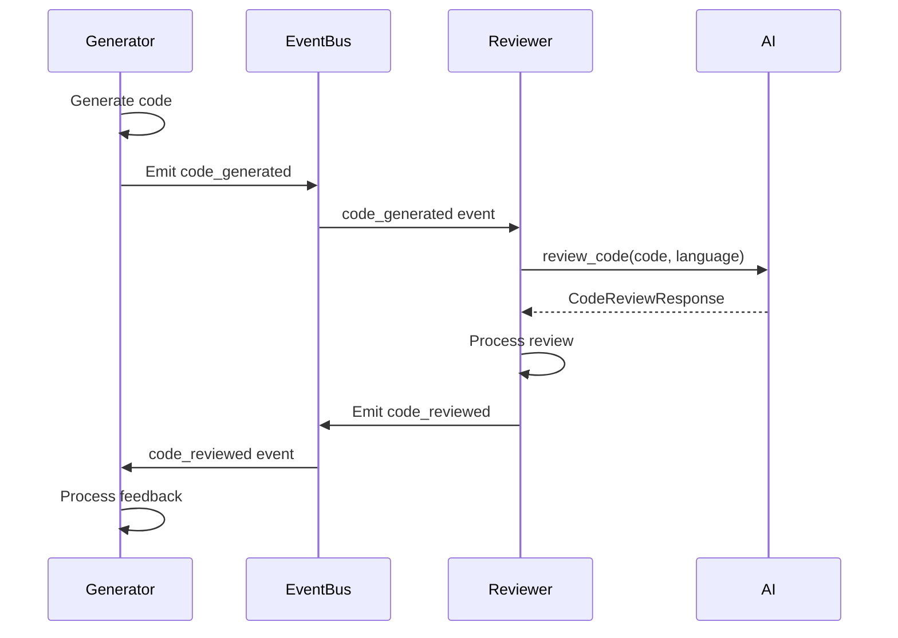
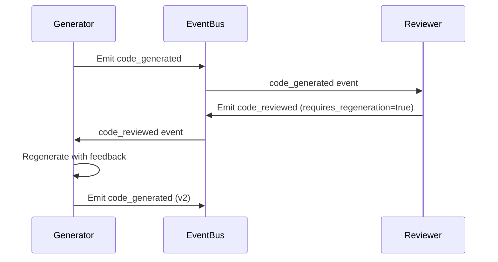
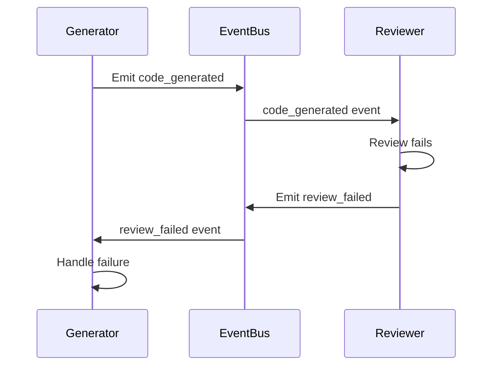

# Contrato: Generator ↔ Reviewer

## Metadados
- **Versão**: 1.0.0
- **Data**: 2024-01-15
- **Status**: Ativo
- **Responsável**: Equipe de Desenvolvimento
- **Revisado por**: Arquiteto de Sistema

## Visão Geral
Este contrato define como o agente Generator envia código gerado para o agente Reviewer e recebe feedback para melhorias. É um fluxo assíncrono baseado em eventos que permite iteração contínua na qualidade do código.

## Dependências
- Generator depende de: AI Service, Workspace Manager
- Reviewer depende de: AI Service, Code Analyzer
- Ambos dependem de: Event Bus, Session Manager

## Interface

### Generator → Reviewer

#### Evento: `code_generated`
```python
class CodeGeneratedEvent:
    session_id: str
    agent_id: str  # ID do Generator
    code: str
    language: str
    context: Dict[str, Any]
    requirements: List[str]
    generation_metadata: Dict[str, Any]
    timestamp: datetime
    priority: str = "normal"  # "low", "normal", "high", "urgent"
```

**Campos obrigatórios:**
- `session_id`: ID da sessão de desenvolvimento
- `agent_id`: ID do agente Generator
- `code`: Código gerado
- `language`: Linguagem de programação
- `timestamp`: Timestamp da geração

**Campos opcionais:**
- `context`: Contexto do projeto (arquivos existentes, dependências)
- `requirements`: Lista de requisitos atendidos
- `generation_metadata`: Metadados da geração (modelo usado, confiança, etc.)
- `priority`: Prioridade da revisão

### Reviewer → Generator

#### Evento: `code_reviewed`
```python
class CodeReviewedEvent:
    session_id: str
    original_event_id: str  # ID do evento code_generated
    reviewer_id: str  # ID do Reviewer
    original_code: str
    review_result: ReviewResult
    suggestions: List[CodeSuggestion]
    issues: List[CodeIssue]
    overall_score: float  # 0.0 a 1.0
    review_metadata: Dict[str, Any]
    timestamp: datetime
    requires_regeneration: bool
```

#### Evento: `review_failed`
```python
class ReviewFailedEvent:
    session_id: str
    original_event_id: str
    reviewer_id: str
    error_type: str
    error_message: str
    retry_after: Optional[int] = None  # segundos
    timestamp: datetime
```

## Tipos de Dados

### ReviewResult
```python
from enum import Enum

class ReviewResult(Enum):
    APPROVED = "approved"           # Código aprovado sem mudanças
    APPROVED_WITH_SUGGESTIONS = "approved_with_suggestions"  # Aprovado com sugestões
    NEEDS_IMPROVEMENT = "needs_improvement"  # Precisa melhorar
    REJECTED = "rejected"           # Rejeitado, precisa regerar
```

### CodeSuggestion
```python
@dataclass
class CodeSuggestion:
    type: str  # "optimization", "style", "security", "performance", "readability"
    description: str
    priority: str  # "low", "medium", "high"
    line_start: Optional[int] = None
    line_end: Optional[int] = None
    suggested_code: Optional[str] = None
    reasoning: Optional[str] = None
```

### CodeIssue
```python
@dataclass
class CodeIssue:
    severity: str  # "error", "warning", "info"
    category: str  # "bug", "security", "performance", "style", "logic"
    line: int
    column: Optional[int] = None
    message: str
    suggestion: Optional[str] = None
    confidence: float = 1.0  # 0.0 a 1.0
    rule_id: Optional[str] = None  # ID da regra que foi violada
```

## Fluxo de Dados

### 1. Fluxo Normal de Revisão


### 2. Fluxo com Regeneração


### 3. Fluxo com Falha


## Tratamento de Erros

### Tipos de Erro
- **INVALID_CODE**: Código gerado é inválido
- **UNSUPPORTED_LANGUAGE**: Linguagem não suportada
- **REVIEW_TIMEOUT**: Timeout na revisão
- **AI_SERVICE_ERROR**: Erro no serviço de IA
- **CONTEXT_MISSING**: Contexto necessário não fornecido

### Estratégia de Retry
```python
class ReviewRetryStrategy:
    max_retries = 3
    base_delay = 5  # segundos
    
    async def handle_review_failure(self, event: ReviewFailedEvent):
        if event.retry_after:
            await asyncio.sleep(event.retry_after)
        
        # Retry logic
        for attempt in range(self.max_retries):
            try:
                await self.retry_review(event)
                break
            except Exception as e:
                if attempt == self.max_retries - 1:
                    await self.notify_generator_of_failure(event, e)
                else:
                    delay = self.base_delay * (2 ** attempt)
                    await asyncio.sleep(delay)
```

## Versionamento

### v1.0.0 (Atual)
- Comunicação básica via eventos
- Suporte a revisão de código
- Sistema de sugestões e issues
- Tratamento de falhas

### Próximas Versões
- **v1.1.0**: Suporte a revisão incremental
- **v1.2.0**: Revisão colaborativa (múltiplos reviewers)
- **v1.3.0**: Aprendizado baseado em feedback
- **v2.0.0**: Revisão em tempo real

## Exemplos

### Exemplo 1: Geração e Revisão Normal
```python
# Generator emitindo evento
code_event = CodeGeneratedEvent(
    session_id="session_123",
    agent_id="generator_001",
    code="""
def fibonacci(n):
    if n <= 1:
        return n
    return fibonacci(n-1) + fibonacci(n-2)
    """,
    language="python",
    context={
        "project_type": "algorithm",
        "existing_functions": ["math_utils.py"]
    },
    requirements=["recursive", "efficient"],
    generation_metadata={
        "model": "gpt-4",
        "confidence": 0.85,
        "generation_time": 2.3
    },
    timestamp=datetime.utcnow()
)

await event_bus.emit("code_generated", code_event)
```

```python
# Reviewer processando evento
async def handle_code_generated(event: CodeGeneratedEvent):
    try:
        # Revisar código
        review = await ai_service.review_code(
            code=event.code,
            language=event.language,
            review_type="comprehensive"
        )
        
        # Criar evento de resposta
        review_event = CodeReviewedEvent(
            session_id=event.session_id,
            original_event_id=event.id,
            reviewer_id="reviewer_001",
            original_code=event.code,
            review_result=ReviewResult.APPROVED_WITH_SUGGESTIONS,
            suggestions=[
                CodeSuggestion(
                    type="performance",
                    description="Consider using memoization for better performance",
                    priority="medium",
                    suggested_code="from functools import lru_cache\n\n@lru_cache(maxsize=None)\ndef fibonacci(n):"
                )
            ],
            issues=[
                CodeIssue(
                    severity="warning",
                    category="performance",
                    line=4,
                    message="Recursive implementation may be slow for large n",
                    suggestion="Consider iterative approach or memoization"
                )
            ],
            overall_score=0.75,
            review_metadata={
                "review_time": 1.8,
                "issues_found": 1,
                "suggestions_count": 1
            },
            timestamp=datetime.utcnow(),
            requires_regeneration=False
        )
        
        await event_bus.emit("code_reviewed", review_event)
        
    except Exception as e:
        # Emitir evento de falha
        failure_event = ReviewFailedEvent(
            session_id=event.session_id,
            original_event_id=event.id,
            reviewer_id="reviewer_001",
            error_type="AI_SERVICE_ERROR",
            error_message=str(e),
            timestamp=datetime.utcnow()
        )
        await event_bus.emit("review_failed", failure_event)
```

### Exemplo 2: Regeneração com Feedback
```python
# Generator processando feedback
async def handle_code_reviewed(event: CodeReviewedEvent):
    if event.requires_regeneration:
        # Incorporar feedback na próxima geração
        improved_prompt = f"""
        Original code: {event.original_code}
        
        Issues found:
        {[issue.message for issue in event.issues]}
        
        Suggestions:
        {[suggestion.description for suggestion in event.suggestions]}
        
        Please regenerate the code addressing these issues.
        """
        
        # Gerar novo código
        new_code = await ai_service.generate_code(
            specification=improved_prompt,
            language=event.original_code.split('\n')[0],  # Extract language
            context=event.review_metadata
        )
        
        # Emitir novo evento
        new_event = CodeGeneratedEvent(
            session_id=event.session_id,
            agent_id="generator_001",
            code=new_code.code,
            language=new_code.language,
            context={"previous_review": event.review_metadata},
            requirements=["addressed_feedback"],
            generation_metadata={
                "iteration": 2,
                "based_on_feedback": True
            },
            timestamp=datetime.utcnow()
        )
        
        await event_bus.emit("code_generated", new_event)
    else:
        # Apenas aplicar sugestões se possível
        await apply_suggestions(event.suggestions)
```

## Monitoramento

### Métricas
- Taxa de aprovação na primeira revisão: > 60%
- Tempo médio de revisão: < 30 segundos
- Taxa de regeneração: < 40%
- Taxa de falha na revisão: < 5%

### Alertas
- Taxa de aprovação < 40%: Investigar qualidade do Generator
- Tempo de revisão > 60 segundos: Investigar performance
- Taxa de falha > 10%: Investigar estabilidade
- Muitas regenerações: Otimizar processo

## Changelog

### v1.0.0 (2024-01-15)
- Implementação inicial do contrato
- Comunicação via eventos assíncronos
- Sistema de revisão e feedback
- Tratamento de falhas e retry

---

**Importante**: Este contrato é obrigatório e deve ser seguido por ambos os agentes. Mudanças requerem aprovação de arquiteto e atualização de versão.


