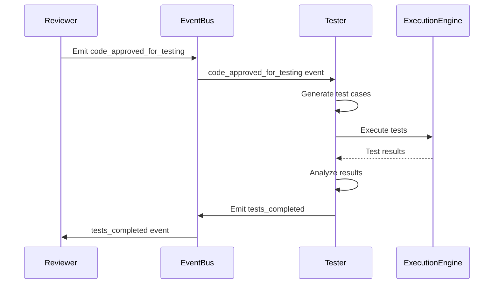
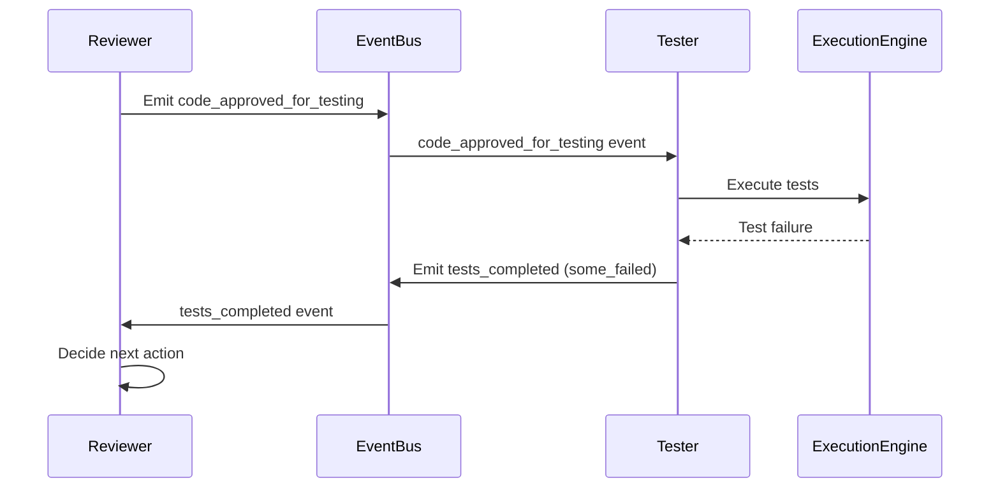
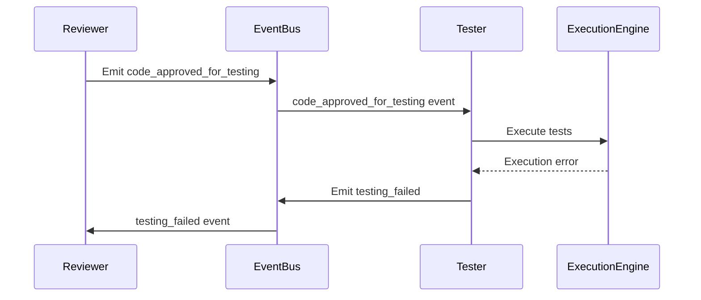

# Contrato: Reviewer ↔ Tester

## Metadados
- **Versão**: 1.0.0
- **Data**: 2024-01-15
- **Status**: Ativo
- **Responsável**: Equipe de Desenvolvimento
- **Revisado por**: Arquiteto de Sistema

## Visão Geral
Este contrato define como o agente Reviewer envia código aprovado para o agente Tester e recebe resultados de testes. O Tester é responsável por executar testes automatizados e validar a funcionalidade do código gerado.

## Dependências
- Reviewer depende de: AI Service, Code Analyzer
- Tester depende de: Execution Engine, Test Framework, Workspace Manager
- Ambos dependem de: Event Bus, Session Manager

## Interface

### Reviewer → Tester

#### Evento: `code_approved_for_testing`
```python
class CodeApprovedForTestingEvent:
    session_id: str
    reviewer_id: str
    code: str
    language: str
    test_requirements: List[TestRequirement]
    context: Dict[str, Any]
    review_metadata: Dict[str, Any]
    timestamp: datetime
    priority: str = "normal"
    timeout_seconds: int = 300  # 5 minutos default
```

**Campos obrigatórios:**
- `session_id`: ID da sessão de desenvolvimento
- `reviewer_id`: ID do agente Reviewer
- `code`: Código aprovado para teste
- `language`: Linguagem de programação
- `test_requirements`: Lista de requisitos de teste
- `timestamp`: Timestamp da aprovação

**Campos opcionais:**
- `context`: Contexto do projeto e dependências
- `review_metadata`: Metadados da revisão
- `priority`: Prioridade dos testes
- `timeout_seconds`: Timeout para execução dos testes

### Tester → Reviewer

#### Evento: `tests_completed`
```python
class TestsCompletedEvent:
    session_id: str
    original_event_id: str
    tester_id: str
    original_code: str
    test_results: List[TestResult]
    overall_status: TestStatus
    coverage_report: Optional[CoverageReport]
    performance_metrics: Optional[PerformanceMetrics]
    execution_metadata: Dict[str, Any]
    timestamp: datetime
    recommendations: List[str]
```

#### Evento: `testing_failed`
```python
class TestingFailedEvent:
    session_id: str
    original_event_id: str
    tester_id: str
    error_type: str
    error_message: str
    partial_results: Optional[List[TestResult]]
    retry_after: Optional[int] = None
    timestamp: datetime
```

## Tipos de Dados

### TestRequirement
```python
@dataclass
class TestRequirement:
    type: str  # "unit", "integration", "performance", "security", "functional"
    description: str
    priority: str  # "critical", "high", "medium", "low"
    expected_behavior: str
    test_data: Optional[Dict[str, Any]] = None
    assertions: Optional[List[str]] = None
```

### TestResult
```python
@dataclass
class TestResult:
    test_name: str
    test_type: str
    status: str  # "passed", "failed", "skipped", "error"
    execution_time: float
    error_message: Optional[str] = None
    output: Optional[str] = None
    assertions_passed: Optional[int] = None
    assertions_total: Optional[int] = None
    coverage_percentage: Optional[float] = None
```

### TestStatus
```python
from enum import Enum

class TestStatus(Enum):
    ALL_PASSED = "all_passed"
    SOME_FAILED = "some_failed"
    ALL_FAILED = "all_failed"
    TIMEOUT = "timeout"
    ERROR = "error"
```

### CoverageReport
```python
@dataclass
class CoverageReport:
    overall_coverage: float  # 0.0 a 1.0
    line_coverage: float
    branch_coverage: float
    function_coverage: float
    uncovered_lines: List[int]
    uncovered_functions: List[str]
    coverage_by_file: Dict[str, float]
```

### PerformanceMetrics
```python
@dataclass
class PerformanceMetrics:
    execution_time: float
    memory_usage: float  # MB
    cpu_usage: float  # percentage
    io_operations: int
    network_calls: int
    bottlenecks: List[str]
```

## Fluxo de Dados

### 1. Fluxo Normal de Teste


### 2. Fluxo com Falha nos Testes


### 3. Fluxo com Falha na Execução


## Tratamento de Erros

### Tipos de Erro
- **EXECUTION_TIMEOUT**: Timeout na execução dos testes
- **COMPILATION_ERROR**: Erro de compilação do código
- **RUNTIME_ERROR**: Erro durante execução
- **TEST_FRAMEWORK_ERROR**: Erro no framework de testes
- **RESOURCE_EXHAUSTED**: Recursos insuficientes
- **INVALID_TEST_REQUIREMENTS**: Requisitos de teste inválidos

### Estratégia de Retry
```python
class TestingRetryStrategy:
    max_retries = 2
    base_delay = 10  # segundos
    
    async def handle_testing_failure(self, event: TestingFailedEvent):
        if event.retry_after:
            await asyncio.sleep(event.retry_after)
        
        # Retry apenas para erros recuperáveis
        recoverable_errors = ["EXECUTION_TIMEOUT", "RESOURCE_EXHAUSTED"]
        
        if event.error_type in recoverable_errors:
            for attempt in range(self.max_retries):
                try:
                    await self.retry_testing(event)
                    break
                except Exception as e:
                    if attempt == self.max_retries - 1:
                        await self.notify_reviewer_of_failure(event, e)
                    else:
                        delay = self.base_delay * (2 ** attempt)
                        await asyncio.sleep(delay)
```

## Versionamento

### v1.0.0 (Atual)
- Comunicação via eventos assíncronos
- Suporte a múltiplos tipos de teste
- Relatórios de cobertura
- Métricas de performance

### Próximas Versões
- **v1.1.0**: Testes de integração com banco de dados
- **v1.2.0**: Testes de segurança automatizados
- **v1.3.0**: Testes de carga e performance
- **v2.0.0**: Testes baseados em IA

## Exemplos

### Exemplo 1: Aprovação para Teste
```python
# Reviewer emitindo evento
testing_event = CodeApprovedForTestingEvent(
    session_id="session_123",
    reviewer_id="reviewer_001",
    code="""
def fibonacci(n):
    if n <= 1:
        return n
    return fibonacci(n-1) + fibonacci(n-2)

def fibonacci_iterative(n):
    if n <= 1:
        return n
    a, b = 0, 1
    for _ in range(2, n + 1):
        a, b = b, a + b
    return b
    """,
    language="python",
    test_requirements=[
        TestRequirement(
            type="unit",
            description="Test basic fibonacci calculation",
            priority="critical",
            expected_behavior="Should return correct fibonacci numbers",
            test_data={"inputs": [0, 1, 5, 10], "expected": [0, 1, 5, 55]}
        ),
        TestRequirement(
            type="performance",
            description="Test performance comparison",
            priority="high",
            expected_behavior="Iterative version should be faster for large n",
            test_data={"n": 30}
        )
    ],
    context={
        "project_type": "algorithm",
        "dependencies": ["pytest", "time"]
    },
    review_metadata={
        "review_score": 0.85,
        "issues_fixed": 2
    },
    timestamp=datetime.utcnow(),
    timeout_seconds=120
)

await event_bus.emit("code_approved_for_testing", testing_event)
```

### Exemplo 2: Resultados de Teste
```python
# Tester processando evento
async def handle_code_approved_for_testing(event: CodeApprovedForTestingEvent):
    try:
        # Gerar e executar testes
        test_results = await execute_tests(event.code, event.test_requirements)
        
        # Calcular cobertura
        coverage = await calculate_coverage(event.code, test_results)
        
        # Medir performance
        performance = await measure_performance(event.code, event.test_requirements)
        
        # Criar evento de resposta
        completed_event = TestsCompletedEvent(
            session_id=event.session_id,
            original_event_id=event.id,
            tester_id="tester_001",
            original_code=event.code,
            test_results=[
                TestResult(
                    test_name="test_fibonacci_basic",
                    test_type="unit",
                    status="passed",
                    execution_time=0.05,
                    assertions_passed=4,
                    assertions_total=4
                ),
                TestResult(
                    test_name="test_fibonacci_performance",
                    test_type="performance",
                    status="passed",
                    execution_time=0.12,
                    output="Iterative version is 10x faster"
                )
            ],
            overall_status=TestStatus.ALL_PASSED,
            coverage_report=CoverageReport(
                overall_coverage=0.95,
                line_coverage=0.95,
                branch_coverage=1.0,
                function_coverage=1.0,
                uncovered_lines=[],
                uncovered_functions=[],
                coverage_by_file={"main.py": 0.95}
            ),
            performance_metrics=PerformanceMetrics(
                execution_time=0.17,
                memory_usage=2.5,
                cpu_usage=15.0,
                io_operations=0,
                network_calls=0,
                bottlenecks=[]
            ),
            execution_metadata={
                "tests_executed": 2,
                "execution_time": 0.17,
                "framework": "pytest"
            },
            timestamp=datetime.utcnow(),
            recommendations=[
                "Code passed all tests successfully",
                "Consider adding edge case tests for negative numbers",
                "Performance is within acceptable limits"
            ]
        )
        
        await event_bus.emit("tests_completed", completed_event)
        
    except Exception as e:
        # Emitir evento de falha
        failure_event = TestingFailedEvent(
            session_id=event.session_id,
            original_event_id=event.id,
            tester_id="tester_001",
            error_type="EXECUTION_ERROR",
            error_message=str(e),
            timestamp=datetime.utcnow()
        )
        await event_bus.emit("testing_failed", failure_event)
```

### Exemplo 3: Processamento de Resultados
```python
# Reviewer processando resultados
async def handle_tests_completed(event: TestsCompletedEvent):
    if event.overall_status == TestStatus.ALL_PASSED:
        # Código aprovado, pode ir para produção
        await approve_for_production(event.session_id, event.original_code)
        
    elif event.overall_status == TestStatus.SOME_FAILED:
        # Alguns testes falharam, precisa revisar
        failed_tests = [t for t in event.test_results if t.status == "failed"]
        
        # Criar feedback para o Generator
        feedback = create_testing_feedback(failed_tests, event.recommendations)
        await send_feedback_to_generator(event.session_id, feedback)
        
    elif event.overall_status == TestStatus.ALL_FAILED:
        # Todos os testes falharam, código precisa ser regenerado
        await request_code_regeneration(event.session_id, event.test_results)

def create_testing_feedback(failed_tests: List[TestResult], recommendations: List[str]) -> str:
    feedback = "Test failures detected:\n"
    for test in failed_tests:
        feedback += f"- {test.test_name}: {test.error_message}\n"
    
    feedback += "\nRecommendations:\n"
    for rec in recommendations:
        feedback += f"- {rec}\n"
    
    return feedback
```

## Monitoramento

### Métricas
- Taxa de aprovação nos testes: > 70%
- Tempo médio de execução: < 60 segundos
- Cobertura média de código: > 80%
- Taxa de falha na execução: < 5%

### Alertas
- Taxa de aprovação < 50%: Investigar qualidade do código
- Tempo de execução > 5 minutos: Investigar performance
- Cobertura < 60%: Adicionar mais testes
- Taxa de falha > 15%: Investigar estabilidade

## Changelog

### v1.0.0 (2024-01-15)
- Implementação inicial do contrato
- Comunicação via eventos assíncronos
- Suporte a múltiplos tipos de teste
- Relatórios de cobertura e performance
- Tratamento de falhas

---

**Importante**: Este contrato é obrigatório e deve ser seguido por ambos os agentes. Mudanças requerem aprovação de arquiteto e atualização de versão.


