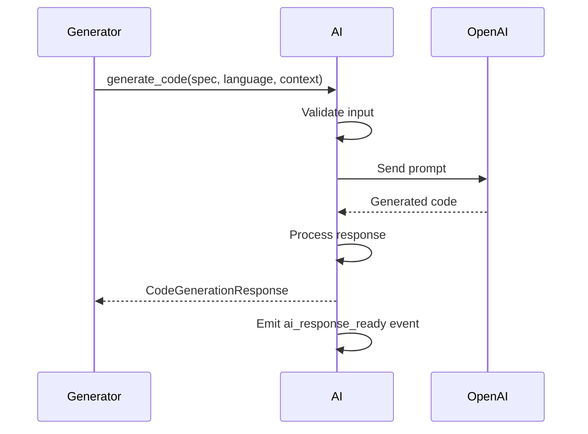
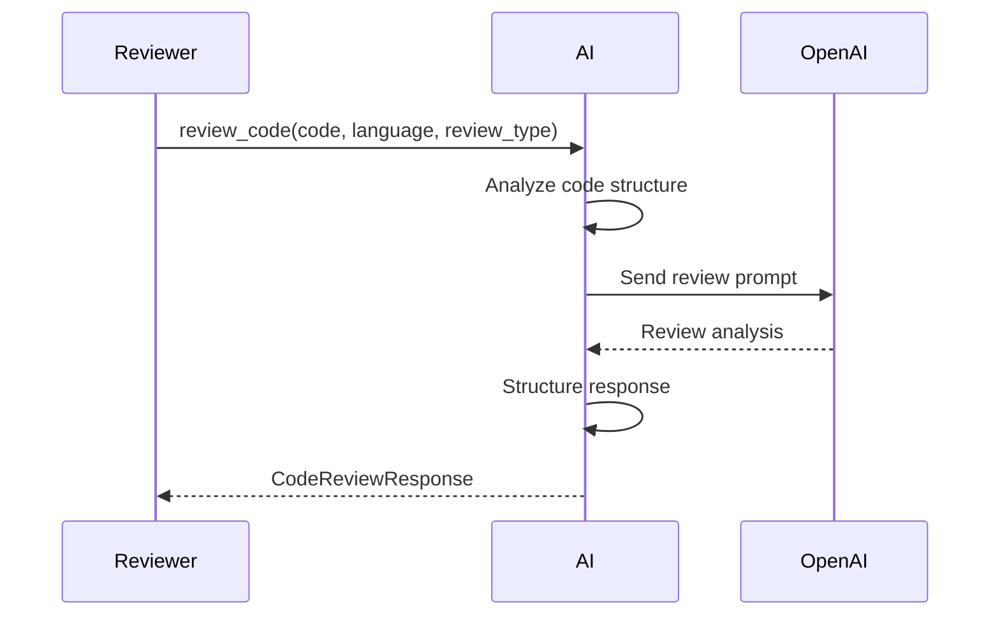
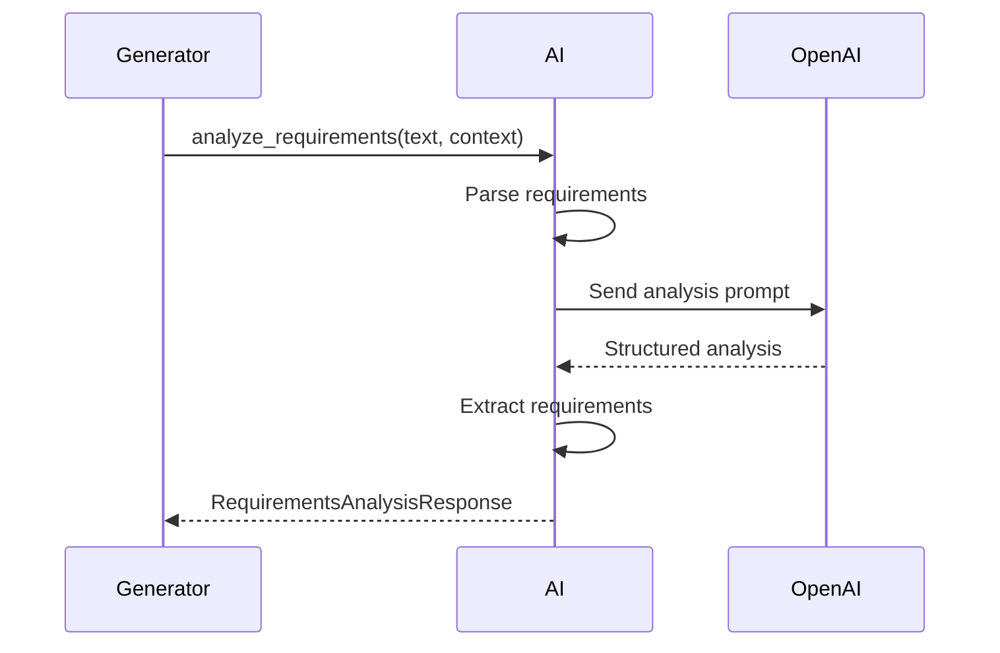

# Contrato: Agents ↔ AI

## Metadados
- **Versão**: 1.0.0
- **Data**: 2024-01-15
- **Status**: Ativo
- **Responsável**: Equipe de Desenvolvimento
- **Revisado por**: Arquiteto de Sistema

## Visão Geral
Este contrato define como os agentes interagem com o módulo AI para processamento de linguagem natural, geração de código e análise de conteúdo. O módulo AI atua como provedor de serviços de IA para todos os agentes da plataforma.

## Dependências
- Agents dependem de: AI Service, OpenAI API
- AI depende de: OpenAI API, Rate Limiter, Cache
- Versão mínima do AI: 1.0.0
- Versão mínima dos Agents: 1.0.0

## Interface

### Agents → AI

#### Método: `process_prompt`
```python
async def process_prompt(
    prompt: str,
    context: Optional[Dict[str, Any]] = None,
    model: str = "gpt-4",
    temperature: float = 0.7,
    max_tokens: Optional[int] = None
) -> AIResponse:
    """
    Processa prompt usando modelo de IA especificado.
    
    Args:
        prompt: Texto do prompt para processamento
        context: Contexto adicional (código, arquivos, etc.)
        model: Modelo a usar (gpt-4, gpt-3.5-turbo, etc.)
        temperature: Criatividade da resposta (0.0 a 1.0)
        max_tokens: Limite máximo de tokens na resposta
        
    Returns:
        AIResponse: Resposta processada pela IA
        
    Raises:
        InvalidPromptError: Se prompt é inválido
        ModelNotAvailableError: Se modelo não está disponível
        RateLimitExceededError: Se limite de taxa foi excedido
        AIProcessingError: Se houve erro no processamento
    """
```

#### Método: `generate_code`
```python
async def generate_code(
    specification: str,
    language: str,
    context: Optional[Dict[str, Any]] = None,
    style_guide: Optional[str] = None
) -> CodeGenerationResponse:
    """
    Gera código baseado em especificação e linguagem.
    
    Args:
        specification: Especificação do código em linguagem natural
        language: Linguagem de programação (python, javascript, etc.)
        context: Contexto do projeto (arquivos existentes, dependências)
        style_guide: Guia de estilo a seguir
        
    Returns:
        CodeGenerationResponse: Código gerado e metadados
        
    Raises:
        UnsupportedLanguageError: Se linguagem não é suportada
        InvalidSpecificationError: Se especificação é inválida
        CodeGenerationError: Se houve erro na geração
    """
```

#### Método: `review_code`
```python
async def review_code(
    code: str,
    language: str,
    review_type: str = "comprehensive",
    focus_areas: Optional[List[str]] = None
) -> CodeReviewResponse:
    """
    Revisa código e fornece feedback detalhado.
    
    Args:
        code: Código a ser revisado
        language: Linguagem de programação
        review_type: Tipo de revisão (comprehensive, security, performance)
        focus_areas: Áreas específicas para focar (bugs, style, performance)
        
    Returns:
        CodeReviewResponse: Análise detalhada do código
        
    Raises:
        InvalidCodeError: Se código é inválido
        UnsupportedLanguageError: Se linguagem não é suportada
        ReviewError: Se houve erro na revisão
    """
```

#### Método: `analyze_requirements`
```python
async def analyze_requirements(
    requirements_text: str,
    project_context: Optional[Dict[str, Any]] = None
) -> RequirementsAnalysisResponse:
    """
    Analisa requisitos e extrai informações estruturadas.
    
    Args:
        requirements_text: Texto dos requisitos
        project_context: Contexto do projeto
        
    Returns:
        RequirementsAnalysisResponse: Análise estruturada dos requisitos
        
    Raises:
        InvalidRequirementsError: Se requisitos são inválidos
        AnalysisError: Se houve erro na análise
    """
```

### AI → Agents

#### Evento: `ai_response_ready`
```python
class AIResponseEvent:
    request_id: str
    agent_id: str
    response: AIResponse
    timestamp: datetime
    model_used: str
    processing_time: float
    tokens_used: int
```

#### Evento: `ai_error_occurred`
```python
class AIErrorEvent:
    request_id: str
    agent_id: str
    error_type: str
    error_message: str
    timestamp: datetime
    retry_after: Optional[int] = None
```

## Tipos de Dados

### AIResponse
```python
from dataclasses import dataclass
from typing import List, Optional, Dict, Any

@dataclass
class AIResponse:
    content: str
    confidence: float  # 0.0 a 1.0
    reasoning: Optional[str] = None
    suggestions: Optional[List[str]] = None
    metadata: Optional[Dict[str, Any]] = None
```

### CodeGenerationResponse
```python
@dataclass
class CodeGenerationResponse:
    code: str
    language: str
    explanation: str
    dependencies: List[str]
    test_suggestions: List[str]
    complexity_score: float
    confidence: float
    metadata: Dict[str, Any]
```

### CodeReviewResponse
```python
@dataclass
class CodeIssue:
    line: int
    column: int
    severity: str  # "error", "warning", "info"
    category: str  # "style", "bug", "performance", "security"
    message: str
    suggestion: Optional[str] = None

@dataclass
class CodeReviewResponse:
    overall_score: float  # 0.0 a 1.0
    issues: List[CodeIssue]
    strengths: List[str]
    improvements: List[str]
    complexity_analysis: Dict[str, Any]
    security_analysis: Dict[str, Any]
    performance_analysis: Dict[str, Any]
```

### RequirementsAnalysisResponse
```python
@dataclass
class Requirement:
    id: str
    text: str
    category: str  # "functional", "non-functional", "constraint"
    priority: str  # "high", "medium", "low"
    complexity: str  # "simple", "moderate", "complex"
    dependencies: List[str]

@dataclass
class RequirementsAnalysisResponse:
    requirements: List[Requirement]
    summary: str
    estimated_effort: str
    risk_assessment: Dict[str, Any]
    recommendations: List[str]
```

## Fluxo de Dados

### 1. Geração de Código


### 2. Revisão de Código


### 3. Análise de Requisitos


## Tratamento de Erros

### Códigos de Erro
- **400 Bad Request**: Prompt ou dados inválidos
- **401 Unauthorized**: API key inválida
- **429 Too Many Requests**: Rate limit excedido
- **500 Internal Server Error**: Erro interno do AI
- **503 Service Unavailable**: Serviço temporariamente indisponível

### Exemplo de Resposta de Erro
```json
{
  "error": "RATE_LIMIT_EXCEEDED",
  "message": "Rate limit exceeded. Please try again later.",
  "details": {
    "limit": 60,
    "window": "1 minute",
    "retry_after": 30
  },
  "timestamp": "2024-01-15T10:30:00Z"
}
```

## Rate Limiting

### Limites por Agente
- **Generator**: 30 requests/minuto, 1000 tokens/minuto
- **Reviewer**: 20 requests/minuto, 800 tokens/minuto
- **Tester**: 15 requests/minuto, 600 tokens/minuto
- **Debugger**: 25 requests/minuto, 900 tokens/minuto

### Estratégia de Retry
```python
async def call_ai_with_retry(func, *args, **kwargs):
    max_retries = 3
    base_delay = 1
    
    for attempt in range(max_retries):
        try:
            return await func(*args, **kwargs)
        except RateLimitExceededError as e:
            if attempt < max_retries - 1:
                delay = base_delay * (2 ** attempt)
                await asyncio.sleep(delay)
            else:
                raise
```

## Cache

### Estratégia de Cache
- **Prompts similares**: Cache por 1 hora
- **Código gerado**: Cache por 24 horas
- **Revisões de código**: Cache por 6 horas
- **Análises de requisitos**: Cache por 12 horas

### Chave de Cache
```python
def generate_cache_key(prompt: str, context: Dict, model: str) -> str:
    content = f"{prompt}:{json.dumps(context, sort_keys=True)}:{model}"
    return hashlib.md5(content.encode()).hexdigest()
```

## Versionamento

### v1.0.0 (Atual)
- Suporte a geração de código
- Revisão básica de código
- Análise de requisitos
- Rate limiting por agente
- Cache de respostas

### Próximas Versões
- **v1.1.0**: Suporte a mais linguagens de programação
- **v1.2.0**: Análise de segurança avançada
- **v1.3.0**: Geração de testes automatizados
- **v2.0.0**: Suporte a modelos locais

## Exemplos

### Exemplo 1: Geração de Código
```python
# Generator chamando AI
try:
    response = await ai_service.generate_code(
        specification="Create a function that calculates fibonacci numbers",
        language="python",
        context={
            "existing_functions": ["math_utils.py"],
            "style_guide": "pep8"
        }
    )
    
    print(f"Generated code: {response.code}")
    print(f"Confidence: {response.confidence}")
    print(f"Dependencies: {response.dependencies}")
    
except UnsupportedLanguageError:
    print("Language not supported")
except CodeGenerationError as e:
    print(f"Generation failed: {e}")
```

### Exemplo 2: Revisão de Código
```python
# Reviewer chamando AI
try:
    review = await ai_service.review_code(
        code=python_code,
        language="python",
        review_type="comprehensive",
        focus_areas=["bugs", "performance", "security"]
    )
    
    print(f"Overall score: {review.overall_score}")
    for issue in review.issues:
        print(f"Line {issue.line}: {issue.message}")
        
except InvalidCodeError:
    print("Invalid code provided")
except ReviewError as e:
    print(f"Review failed: {e}")
```

### Exemplo 3: Análise de Requisitos
```python
# Generator analisando requisitos
try:
    analysis = await ai_service.analyze_requirements(
        requirements_text="""
        1. Sistema deve permitir login de usuários
        2. Deve ter interface responsiva
        3. Deve processar pagamentos
        """,
        project_context={"type": "web_app", "framework": "fastapi"}
    )
    
    for req in analysis.requirements:
        print(f"Requirement {req.id}: {req.text}")
        print(f"Priority: {req.priority}, Complexity: {req.complexity}")
        
except InvalidRequirementsError:
    print("Invalid requirements format")
except AnalysisError as e:
    print(f"Analysis failed: {e}")
```

## Monitoramento

### Métricas
- Taxa de sucesso das chamadas: > 95%
- Tempo médio de resposta: < 2 segundos
- Uso de tokens por agente
- Taxa de cache hit: > 60%
- Erros por tipo e agente

### Alertas
- Taxa de erro > 10%: Alerta imediato
- Tempo de resposta > 5 segundos: Alerta em 5min
- Rate limit excedido: Alerta imediato
- Cache hit rate < 40%: Investigar

## Changelog

### v1.0.0 (2024-01-15)
- Implementação inicial do contrato
- Suporte a geração e revisão de código
- Análise de requisitos
- Sistema de rate limiting
- Cache de respostas

---

**Importante**: Este contrato é obrigatório e deve ser seguido por todos os agentes. Mudanças requerem aprovação de arquiteto e atualização de versão.


