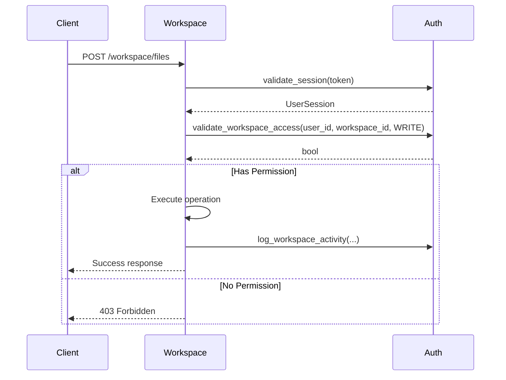
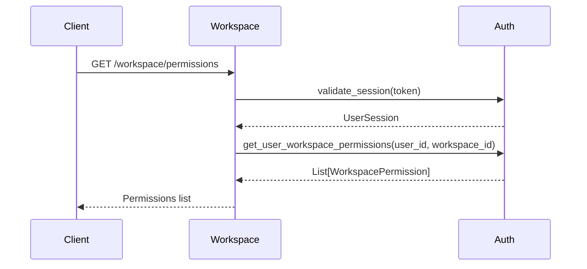

# Contrato: Auth ↔ Workspace

## Metadados
- **Versão**: 1.0.0
- **Data**: 2024-01-15
- **Status**: Ativo
- **Responsável**: Equipe de Desenvolvimento
- **Revisado por**: Arquiteto de Sistema

## Visão Geral
Este contrato define como o módulo Auth valida permissões e autentica usuários para operações no módulo Workspace. O Workspace depende do Auth para todas as operações que requerem autenticação e autorização.

## Dependências
- Auth depende de: User Repository, Refresh Token Repository
- Workspace depende de: Auth Service, File System
- Versão mínima do Auth: 1.0.0
- Versão mínima do Workspace: 1.0.0

## Interface

### Auth → Workspace

#### Método: `validate_workspace_access`
```python
async def validate_workspace_access(
    user_id: str,
    workspace_id: str,
    operation: WorkspaceOperation
) -> bool:
    """
    Valida se usuário tem permissão para operação específica no workspace.
    
    Args:
        user_id: ID único do usuário
        workspace_id: ID único do workspace
        operation: Tipo de operação (READ, WRITE, DELETE, EXECUTE)
        
    Returns:
        bool: True se usuário tem permissão, False caso contrário
        
    Raises:
        UserNotFoundError: Se usuário não existe
        WorkspaceNotFoundError: Se workspace não existe
        InvalidOperationError: Se operação não é válida
    """
```

#### Método: `get_user_workspace_permissions`
```python
async def get_user_workspace_permissions(
    user_id: str,
    workspace_id: str
) -> List[WorkspacePermission]:
    """
    Retorna lista de permissões do usuário no workspace.
    
    Args:
        user_id: ID único do usuário
        workspace_id: ID único do workspace
        
    Returns:
        List[WorkspacePermission]: Lista de permissões
        
    Raises:
        UserNotFoundError: Se usuário não existe
        WorkspaceNotFoundError: Se workspace não existe
    """
```

#### Método: `validate_session`
```python
async def validate_session(
    session_token: str
) -> Optional[UserSession]:
    """
    Valida token de sessão e retorna dados da sessão.
    
    Args:
        session_token: Token de sessão JWT
        
    Returns:
        Optional[UserSession]: Dados da sessão se válida, None se inválida
        
    Raises:
        InvalidTokenError: Se token é inválido
        ExpiredTokenError: Se token expirou
    """
```

### Workspace → Auth

#### Método: `log_workspace_activity`
```python
async def log_workspace_activity(
    user_id: str,
    workspace_id: str,
    operation: str,
    resource_path: str,
    success: bool,
    metadata: Optional[Dict[str, Any]] = None
) -> None:
    """
    Registra atividade do usuário no workspace para auditoria.
    
    Args:
        user_id: ID do usuário que executou a operação
        workspace_id: ID do workspace
        operation: Tipo de operação executada
        resource_path: Caminho do recurso acessado
        success: Se operação foi bem-sucedida
        metadata: Dados adicionais da operação
    """
```

## Tipos de Dados

### WorkspaceOperation
```python
from enum import Enum

class WorkspaceOperation(Enum):
    READ = "read"
    WRITE = "write"
    DELETE = "delete"
    EXECUTE = "execute"
    ADMIN = "admin"
```

### WorkspacePermission
```python
from dataclasses import dataclass
from typing import List

@dataclass
class WorkspacePermission:
    operation: WorkspaceOperation
    resource_pattern: str  # Ex: "*.py", "/src/**", "README.md"
    granted: bool
    expires_at: Optional[datetime] = None
```

### UserSession
```python
from dataclasses import dataclass
from datetime import datetime
from typing import List

@dataclass
class UserSession:
    user_id: str
    session_id: str
    created_at: datetime
    expires_at: datetime
    permissions: List[WorkspacePermission]
    is_admin: bool
```

## Fluxo de Dados

### 1. Operação no Workspace


### 2. Listagem de Permissões


## Tratamento de Erros

### Códigos de Erro
- **400 Bad Request**: Dados inválidos na requisição
- **401 Unauthorized**: Token inválido ou expirado
- **403 Forbidden**: Usuário não tem permissão
- **404 Not Found**: Usuário ou workspace não existe
- **500 Internal Server Error**: Erro interno do sistema

### Exemplo de Resposta de Erro
```json
{
  "error": "INSUFFICIENT_PERMISSIONS",
  "message": "User does not have WRITE permission for this workspace",
  "details": {
    "user_id": "123",
    "workspace_id": "456",
    "required_operation": "WRITE",
    "user_permissions": ["READ"]
  },
  "timestamp": "2024-01-15T10:30:00Z"
}
```

## Versionamento

### v1.0.0 (Atual)
- Validação básica de permissões
- Suporte a operações READ, WRITE, DELETE, EXECUTE
- Logging de atividades
- Validação de sessão JWT

### Próximas Versões
- **v1.1.0**: Suporte a permissões granulares por arquivo
- **v1.2.0**: Cache de permissões para performance
- **v2.0.0**: Sistema de roles e grupos

## Exemplos

### Exemplo 1: Validação de Acesso
```python
# Workspace chamando Auth
try:
    has_permission = await auth_service.validate_workspace_access(
        user_id="user_123",
        workspace_id="workspace_456",
        operation=WorkspaceOperation.WRITE
    )
    
    if has_permission:
        # Executar operação
        await create_file(file_path, content)
    else:
        raise HTTPException(status_code=403, detail="Insufficient permissions")
        
except UserNotFoundError:
    raise HTTPException(status_code=404, detail="User not found")
except WorkspaceNotFoundError:
    raise HTTPException(status_code=404, detail="Workspace not found")
```

### Exemplo 2: Logging de Atividade
```python
# Workspace registrando atividade
await auth_service.log_workspace_activity(
    user_id="user_123",
    workspace_id="workspace_456",
    operation="file_created",
    resource_path="/src/main.py",
    success=True,
    metadata={
        "file_size": 1024,
        "language": "python"
    }
)
```

### Exemplo 3: Validação de Sessão
```python
# Workspace validando sessão
session = await auth_service.validate_session(session_token)
if not session:
    raise HTTPException(status_code=401, detail="Invalid session")

if session.expires_at < datetime.utcnow():
    raise HTTPException(status_code=401, detail="Session expired")
```

## Monitoramento

### Métricas
- Taxa de sucesso de validações: > 99%
- Tempo médio de validação: < 100ms
- Taxa de erros 403: Monitorar picos
- Uso de cache de permissões: Eficiência

### Alertas
- Taxa de erro > 5%: Alerta imediato
- Tempo de resposta > 500ms: Alerta em 5min
- Muitas validações 403: Investigar

## Changelog

### v1.0.0 (2024-01-15)
- Implementação inicial do contrato
- Suporte a validação de permissões básicas
- Sistema de logging de atividades
- Validação de sessão JWT

---

**Importante**: Este contrato é obrigatório e deve ser seguido por ambos os módulos. Mudanças requerem aprovação de arquiteto e atualização de versão.


